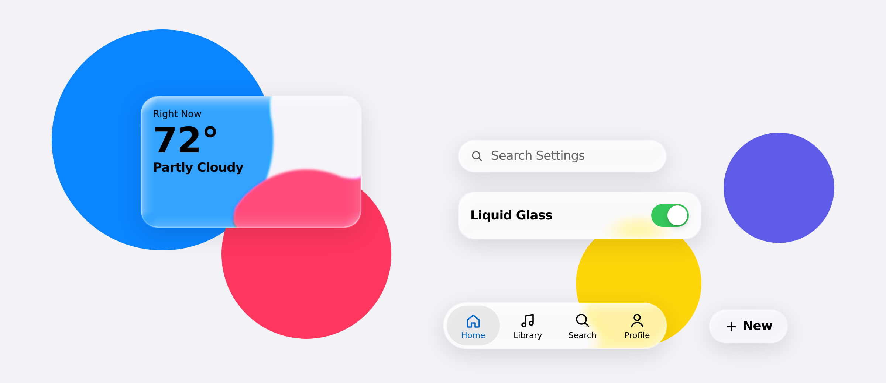

<div align="center">

# santi.glass

A small, Apple-flavored design system for my apps.<br>
Liquid glass that actually refracts, soft pill-shaped controls, SF Pro, and one blue.

<picture>
  <source media="(prefers-color-scheme: dark)" srcset="docs/preview-dark.png">
  
</picture>

</div>

## Why

I wanted my apps (santi.pass, santi.notes, and whatever comes next) to feel like they belong on a Mac or an iPhone, without copying Apple's UI piece by piece. So this repo holds the shared stuff: colors, type, spacing, a handful of React components, and a glass effect that goes past a plain `backdrop-filter: blur()`.

## What's in the box

- **Tokens** for color (light and dark), type, spacing, radii, shadows and the glass lens, all in one [`tokens.json`](tokens.json).
- **12 React components**: `Button`, `GlassCard`, `GlassScene`, `GlassToggle`, `Switch`, `SegmentedControl`, `Slider`, `SearchField`, `List`, `ListRow`, `TabBar` and `Icon`.
- **A liquid glass engine.** The edge of every glass surface bends whatever is behind it, splits it slightly into color, and catches a highlight. It's calculated per element instead of faked with a gradient.
- **Shader glass.** Inside a `GlassScene`, the lens runs as a WebGPU shader (WebGL2 as a fallback), per pixel, with real color dispersion and a highlight that follows your cursor.
- **Desktop apps.** In Tauri, Electron and other webview shells, the native window material (Liquid Glass or vibrancy on macOS, Mica on Windows 11) follows the same switch as the in-app glass. The engine is tuned for long-running windows: cheap live resizing, bounded memory, idle scenes that stop drawing, and recovery after sleep.
- **A system-wide toggle** so people can turn the glass off. It's on by default.

## Quick start

There's no npm package yet, so you copy the files in. You need React 18.

```html
<link rel="stylesheet" href="tokens.css">
<link rel="stylesheet" href="components/bundle.css">

<script src="https://cdn.jsdelivr.net/npm/react@18/umd/react.production.min.js"></script>
<script src="https://cdn.jsdelivr.net/npm/react-dom@18/umd/react-dom.production.min.js"></script>
<script src="components/bundle.js"></script>
```

Everything lives on `window.SantiGlass`:

```js
const { TabBar, GlassCard, Button } = window.SantiGlass;
const h = React.createElement;

ReactDOM.createRoot(document.getElementById('app')).render(
  h(TabBar, {
    defaultValue: 'home',
    items: [
      { id: 'home', label: 'Home', icon: 'house' },
      { id: 'search', label: 'Search', icon: 'search' },
      { id: 'profile', label: 'Profile', icon: 'person' },
    ],
  })
);
```

Types are in [`components/index.d.ts`](components/index.d.ts) if you want autocomplete.

### Themes

Dark mode follows the OS. To force one, set `data-theme` on `<html>`:

```html
<html data-theme="dark">
```

### Changing tokens

Edit `tokens.json`, then rebuild the CSS:

```sh
node scripts/build-tokens.mjs
```

## Liquid glass

Glass is a setting, not a style you opt into per screen. It starts on, and every app that uses this system should ship the switch for it (put `GlassToggle` in your Appearance settings).

```js
const { useLiquidGlass, setLiquidGlass } = window.SantiGlass;

// in a component
const [glassOn, setGlass] = useLiquidGlass();

// anywhere else, e.g. when loading saved settings
setLiquidGlass(false);
```

When it's off, every glass surface turns into a solid panel with a thin border. Nothing moves around, so layouts work either way. It also starts off if the OS has "Reduce transparency" turned on.

**How the lensing works:** for each glass element, the engine builds a displacement map from a rounded bezel profile and Snell's law, then runs it through an SVG filter as a `backdrop-filter`. The red and blue channels get displaced a little more and a little less than green, which gives the color fringe at the edge. A second map adds the rim highlight. You can tune all of it with the `lens-*` tokens (bezel width, depth, index of refraction, aberration, frost, highlight, saturation).

To put glass on your own element, give it the `sg-glass` class and call the hook:

```js
const ref = React.useRef(null);
SantiGlass.useLens(ref, { strong: true }); // strong = more frost, for small text
```

### Shader glass

A plain `backdrop-filter` can refract live page content, but a shader can't see the page. So the GPU version lives in `GlassScene`, which owns its backdrop and refracts that instead:

```js
h(SantiGlass.GlassScene, { backdrop: 'cover.jpg', style: { height: 420 } },
  h(SantiGlass.GlassCard, { style: { position: 'absolute', left: 24, bottom: 24 } }, 'Now Playing')
);
```

Any glass component inside the scene switches to the shader automatically. It tries WebGPU first and falls back to WebGL2. Pass `live: true` for video or an animated canvas.

### Desktop apps

- **Tauri:** [docs/tauri.md](docs/tauri.md) has the Rust command that turns the native window glass on and off, the config flags, and the one-line hook that keeps it in sync with the toggle.
- **Electron and other shells:** [docs/desktop.md](docs/desktop.md) has the preload and main-process code, the contract for any other host (Wails, WebView2, CEF), and what the engine does to stay fast in windows that stay open for hours.

Either way, the page side is one call: `SantiGlass.syncWindowGlass()`.

### Browser support

| Engine | What you get |
| --- | --- |
| Chromium (Chrome, Edge, Electron, Tauri on Windows) | Full refraction everywhere, plus WebGPU shader glass in `GlassScene` |
| Safari, WKWebView (Tauri on macOS), Firefox | Frosted blur for regular glass (no SVG filters in `backdrop-filter`), shader glass in `GlassScene` through WebGPU or WebGL2 |
| Glass turned off | Solid surfaces everywhere |

You can check which one you got with `SantiGlass.lensSupported`, or the `data-lens` attribute on `<html>` (`refract` or `blur`).

## Fonts

The type stacks ask for the system font first, which is SF Pro on macOS and iOS. Everywhere else, `tokens.css` loads the web fonts in `fonts/`, all Latin-subset woff2:

| Family | File | Weights | Italic |
| --- | --- | --- | --- |
| SF Pro Text, SF Pro Display, SF Pro | `SF-Pro.woff2`, `SF-Pro-Italic.woff2` (variable) | 1 to 1000 | yes |
| SF Pro Rounded | `SF-Pro-Rounded-*.woff2` | 100 to 900 | no (Apple doesn't make one) |
| SF Mono | `SF-Mono-*.woff2` | 300 to 800 | yes |

SF Pro is the variable font. It also has an optical-size axis, so the browser picks the Text cut at small sizes and the Display cut at 28px and up on its own. Any `font-weight` and `font-style: italic` renders a real face, never a synthesized one (except italic Rounded, which is slanted).

Keep `fonts/` next to `tokens.css` so the relative URLs resolve. The whole folder is about 900 KB, and a browser only downloads the faces a page uses.

## Icons

On Apple platforms, use SF Symbols. Everywhere else, `Icon` covers the basics with simple line glyphs drawn on a 24px grid. They're generic stand-ins, not SF Symbols.

## Project layout

```
tokens.json               source of truth for every token
tokens.css                generated, don't edit by hand
scripts/build-tokens.mjs  tokens.json -> tokens.css
fonts/                    SF Pro (variable + italic), SF Pro Rounded, SF Mono (woff2)
components/
  bundle.js               all components + the glass engines (svg, webgpu, webgl2)
  bundle.css              component styles
  index.d.ts              types
  <Component>/README.md   when and how to use each component
  <Component>/preview.html  live preview
docs/tauri.md             Tauri setup: window glass + shader glass
docs/desktop.md           Electron and other shells, desktop performance notes
AGENTS.md                 working rules for coding agents
GUIDELINES.md             the full design rules (color, type, glass, motion...)
```

If you're building a screen, read [GUIDELINES.md](GUIDELINES.md) first. It covers the stuff the components don't enforce: when to use glass, which colors go where, copy tone, spacing and motion.
